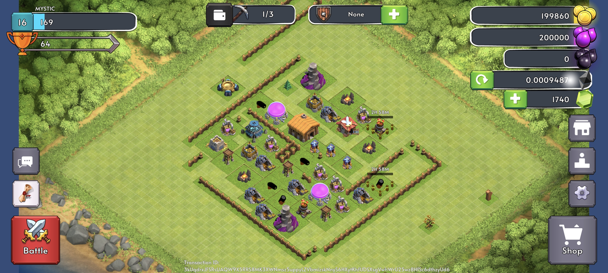

<h1 align="center"> 
    Dominari
</h1>

 
    Armies and Villages, Strengths and Weaknesses, Experiments and Strategies, Raiding and Fortifying. Dominari is a combination of Diversity and Simplicity

 
    (Every decisions are driven by AI and each strategy derived is stored on Eclipse)

 
  

 

## Table of contents 

- [Introduction](#introduction)
  - [About Us](#about-the-team)
  - [Features](#features)
- [Strategy & Gameplay](#strategy-and-gameplay)
  - [Armies and Villages](#armies-and-villages)
  - [Raiding and Fortifying](#raiding-and-fortifying)
  - [Experiments and Strategies](#experiments-and-strategies)
- [Contributors](#contributors)
- [Links](#links)

## Introduction 

Welcome to Dominari, a strategy driven, AI enhanced multiplayer game where players build, defend and conquer in a dynamic, ever evolving world. Every player controls a village (linked to an AI agent that continuously learns and adapts) and shaping in game strategies over time. Powered by the Eclipse blockchain, all ingame actions like training troops, executing attacks, fortifying defenses, collecting resources, and more, are transparently recorded onchain, ensuring fairness, permanence and player ownership

### About Us 

We are a team of four developers dedicated to redefining storytelling in gaming by integrating decentralization and AI. Our mission is to create a game that players engage with not just for months, but for years, evolving with every decision they make.

### Features 

- AI powered evolution: Each player's AI agent continuously analyzes gameplay patterns, decision making and battle outcomes to refine strategic approaches. Over time, it learns from player interactions, enabling smarter troop formations, resource management and attack/defense tactics tailored to each unique playstyle and offer smarter, adaptive strategies

- Decentralized ownership: Every aspect of the game villages, troops, buildings and in game resources are tokenized as NFTs or Tokens, granting players full control over their assets ensuring true digital ownership, enabling trading, renting or upgrading assets without central restrictions

- Onchain Economy: Dominari features a self sustaining, player driven economy where token minting is carefully balanced to prevent inflation. Players can earn and spend ingame tokens for strategic upgrades, village expansion and unique customizations, ensuring long term economic stability

- Clan system: Teamwork is at the heart of Dominari. Players can form or join clans, strategize collaboratively, plan raids, wage wars and build their collective legacy. Clans gain access to exclusive missions, shared resources and strategic advantages when fighting alongside allies

- Dynamic decision making: Every choice players make like alliances, battles, village development, impacts the broader game world. The evolving AI ecosystem ensures that no two playthroughs are the same, with emergent narratives and shifting rivalries shaping an cool gaming experience

[ <a href="#table-of-contents">↑ Back to top ↑</a> ]

### Strategy & Gameplay 

#### Armies and Villages

Each village serves as a player’s stronghold, requiring careful management and defense while expanding influence. Players must train diverse troop types, manage fortifications and coordinate attacks to secure their position.

The AI dynamically assists in:

- Optimizing troop training schedules
- Predicting and countering enemy strategies
- Analyzing battle formations to maximize efficiency

#### Raiding and Fortifying

Players can launch raids to gain resources or fortify their defenses to resist attacks. Each battle presents new tactical challenges, demanding evolving strategies

- Raiding: Players can launch attacks on enemy villages, strategically selecting targets to maximize rewards while minimizing losses. AI driven battle simulations help refine raid strategies and predict possible challenges

- Fortifying: Strengthening village defenses is vital. Players can build and upgrade defensive structures, position troops strategically and their AI predicts enemy attack patterns and counter them effectively

#### Experiments and Strategies

The AI constantly learns from player actions, improving troop efficiency and tactical execution over time. The players can experiment with unit compositions, attack routes and defense mechanisms leading to unique and evolving battle strategies

All strategic decisions, from troop movement to war planning, are recorded onchain, ensuring transparency and long term impact on the game world

## Contributors 

- [Mystic](https://x.com/Gurshabad90)
- [Shan](https://x.com/ShanRasool_)
- [Vivek](https://x.com/theviveksuthar)
- [Karthik](https://twitter.com/0xkarthikjr)

## Links 

- Website: [Dominari](http://dominari.vercel.app)
- Contract Address: [CoCxq74mbbA42R7JwSyYgwToaNuyPkrvFPFV6NBwdsD1](https://eclipsescan.xyz/account/CoCxq74mbbA42R7JwSyYgwToaNuyPkrvFPFV6NBwdsD1?cluster=devnet)
